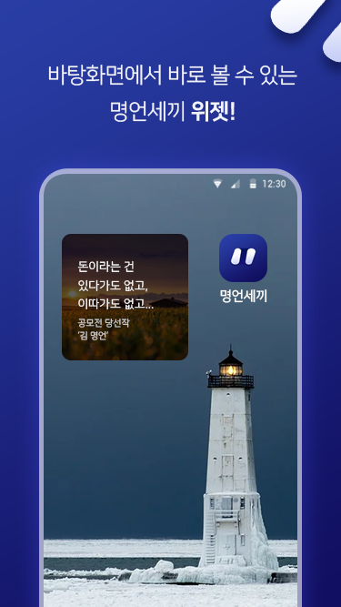
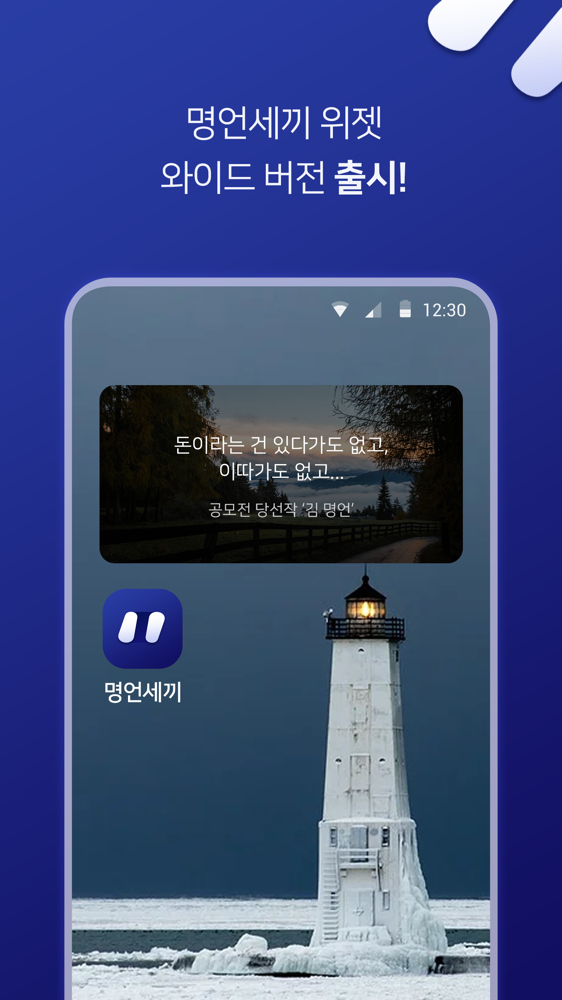
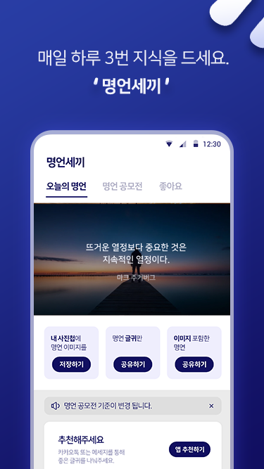
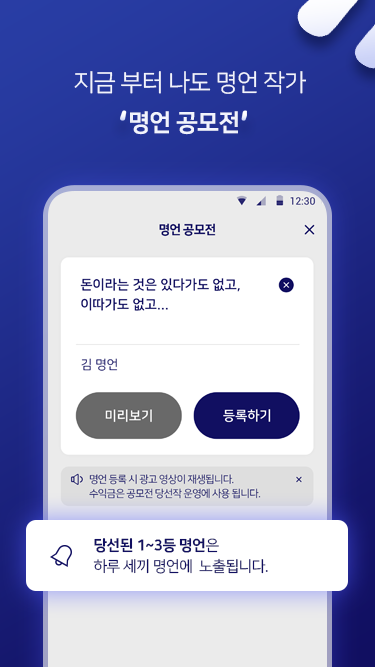

# 명언세끼

    
    
    
    

# App Information
- Provision of quote data 3 times a day.  
(Home Screen Widget)

- Toy Project (Kotlin Learning)
- Initial release date is January 2021.

# Repository
- Part of the main code is released.
- Cannot build with the code in the current repository.
- No further updates.

# Study
- Kotlin Basic Syntax
- DI (Hilt)
- Room (Prepopulate assets database)
- ViewModel, LiveData
- AppWidgetProvider
- Firebase Realtime Database
